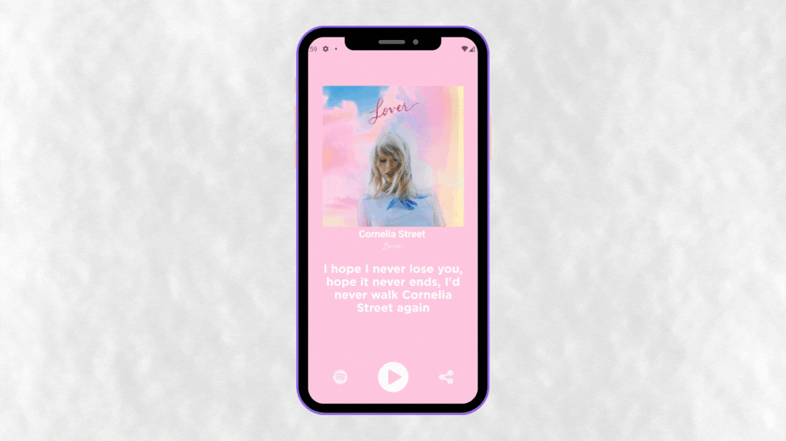

<div align="center">
<h1>Taylor's Love Notes </h1>

<p>&nbsp;<p>
<p>
A platform for users to share various ways of saying "I love you" using lyrics from Taylor Swift songs. Whether you're a die-hard Swiftie or simply adore romantic gestures, this app is perfect for spreading love and creating memorable moments.
</p>
</div>


<div align="center">
  <a href="#technologies">Technologies</a>&nbsp;&nbsp;&nbsp;|&nbsp;&nbsp;&nbsp;
  <a href="#how-to-use">How To Use</a>
</div>
<br>

<div align="center">
  
</div>

>Status: Done ✅
<h2 id="technologies">💻 Technologies Used</h2>


- [React Native](https://reactnative.dev)
- [Expo](https://expo.dev)
- [Firebase](https://firebase.google.com/?hl=pt)
  - [Firestore Database](https://firebase.google.com/docs/firestore?hl=pt-br)
  - [Storage](https://firebase.google.com/docs/storage?hl=pt-br)


<h2>📖 𝗨𝘀𝗲𝗱 𝗟𝗶𝗯𝗿𝗮𝗿𝗶𝗲𝘀/𝗣𝗮𝗰𝗸𝗮𝗴𝗲𝘀</h2>
<ul>
<li>React Native Vector icons</li>
<li>Expo Font</li>
<li>React Native View Shot</li>
</ul>


<h2 id="how-to-use">📌 𝗛𝗼𝘄 𝗧𝗼 𝗨𝘀𝗲</h2>

```bash
# Clone this repository
$ git clone https://github.com/Eliezir/TaylorSwiftLoveNotes

# Go into the repository
$ cd TaylorSwiftLoveNotes

# Install dependencies
$ npm install

# Run the application
$ npx expo start
```

<sub>Made with 💜 by <a href="https://github.com/Eliezir">Eliezir Neto</a> </sub>
